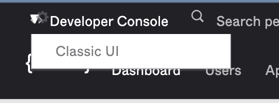
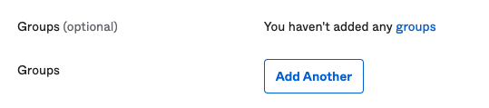

# Okta Setup for `nuxeo-labs-okta`

## Description

This document covers the steps necessary to configure Okta to work with Nuxeo (via the `nuxeo-labs-okta` plugin) for a demo situation. The information is primarily for Nuxeo Presales use, but may be interesting to anyone trying to use Okta with Nuxeo. Please refer to the [README](../README.md) for instructions about using the plug-in itself.

## Prerequisites

You will need an email address in order to set up an Okta developer account. You will also need separate email addresses in order to create Okta users. Note that with a gmail account you can use gmail aliases for each Okta user (e.g. mydemo+bob@gmail.com, mydemo+jane@gmail.com, etc.)

Important note: you may need to use the “Classic UI" in Okta in order to create an Application that uses SAML 2.0 ([reference](https://support.okta.com/help/s/article/Why-can-t-I-add-a-SAML-Application-with-an-Okta-Developer-account?language=en_US)).

These instructions assume you are using the "Classic UI".

## Setup

Sign Up for a Free Okta Developer Account at https://developer.okta.com/

### Set up Okta User Profile

The plugin requires the attributes “firstName”, “lastName”, “email”, and “groups”. The first three are default attributes, but “groups” is a custom attribute that you must add, it is *not* based on Okta groups.

* In the Okta UI go to **Directory** -> **User Profile Editor**
* Select the `User (default)` user profile
* Add a new attribute
* **Data type** `string array`
* **Display name** `Groups`
* **Variable name** `groups` <- case sensitive
* Click **Save**

### Create Application in Okta

* Go to **Applications -> Applications**
* Click **Add Application**
  * This opens the Okta Application directory but we will create a new app...
* Click **Create New App**
* **Platform** `Web`
* **Sign on method** `SAML 2.0`
* Click **Create**
* For **App name** keep in mind this value will be displayed in the sign on dialog, choose something useful
* Same for **App logo**, choose something nice for the demo
* Click **Next**
* **Single sign on URL** `https://yourdemo.cloud.nuxeo.com/nuxeo/ui`
* **Audience URI (SP Entity ID)** `https://yourdemo.cloud.nuxeo.com/nuxeo/ui`
* **Attribute Statements**
  * (you will have 4 total)

    | Name | Name format | Value |
    | - | - | - |
    | lastName | Unspecified | user.lastName |
    | firstName | Unspecified | user.firstName |
    | email | Unspecified | user.email |
    | groups | Unspecified | user.groups |

* Click **Next**
* Select `I'm an Okta customer adding an internal app`
* Click **Finish**

### Update Nuxeo Configuration

The plugin includes the [necessary XML contribution](../studio/contrib.xml) for Okta login. You need to update the URI in the **parameter** property named `metadata`. To get the necessary value:

* In Okta UI go to the Application you created
* Open the **Sign On** tab
  * If you just created the app, the UI is probably already on this page
* Click **View Setup Instructions**
* Note the **Identity Provider Single Sign-On URL**. for example:
  * `https://dev-xxxxxx.okta.com/app/dev-xxxxxx_myapp_1/randomstring/sso/saml`
* Update the URI in the XML contrib to match the above values, for example:
  * `https://dev-xxxxxx.oktapreview.com/app/randomstring/sso/saml/metadata`

Tip: you will need to restart the server after updating for this to work; Hot Reload is not supported for `authenitcators` contributions.

### Add Application for Users

Okta allows you to assign applications to users and/or groups. You can of course configure this however, you want but the easiest way to make sure all the users you create have access to Nuxeo is to add the App to the `Everyone` group in Okta:

* **Directory -> Groups**
* Open `Everyone`
* Click **Manage Applications**
* Click the **Assign** button next to the Application you created

### Create Okta Users

Warning: do not create these users in Studio.

* In Okta UI open **Directory -> People**
* Click **Add person**
* Enter **First Name**, **Last Name**, **Username** (must be an email address), and set up **Groups** using the **Add Another** button.
  * Note that each group name must match the group id in Nuxeo.
  * Warning: don't use Okta groups, you're setting up the custom attribute that you added earlier

* **Password** `Set by admin`
* Enter the password
* Uncheck `User must change password on first login`
* Click **Save** (or **Save and Add Another** if you have more users to create)

## Tips

* If you find you can't log in with one of the users, make sure the user is "Active" in Okta. You can check this in the directory under the **Status** column:

* Don't use the Okta Developer account email address as the email for any Okta user. This way you can avoid confusion switching between the developer console and the end-user experience.
* Be careful to avoid mixing different Okta accounts in the same browser. For example, say you are logged into your Okta developer account in your browser session. Then you open a notification email from Nuxeo. The Okta login will fail and you'll have an error during your demo. When in doubt, use a separate browser session (or use incognito windows) for *each* Okta user.
* If you need to show MFA in your demo, the safest way is to choose a single user specifically for your MFA demo (so that you don't need to do MFA for every single user). You can add multifactor options under **Security -> Multifactor**. Note that you can make MFA optional, assign it only to specific users, etc. by editing the policy using the **Factor Enrollment** tab.

